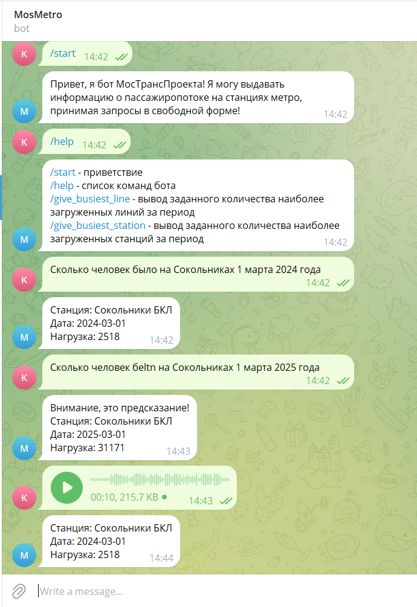

# MoscowMetro
Проект для хакатона "Nuclear IT hack"

Над проектом работали: Дериглазов Тимур, Старотиторов Кирилл, Оводков Александр, Огай Владислав

tg: https://t.me/Moscow_Metro_bbot

## Установка
1. pip install -r requirements.txt --no-index --find-links file:///tmp/packages

2. curl -o ./model.zip https://alphacephei.com/vosk/models/vosk-model-ru-0.22.zip

3. Разархивировать vosk-model-ru-0.22.zip в bot/models, переименовав в model

4. Установить https://www.gyan.dev/ffmpeg/builds/ и добавить в PATH

5. Запустить run.py

## Демонстрация возможностей

## Описание файлов

- bot
  - handlers
  - keyboards
  - models: Методы для работы с текстовым-/аудио- сообщениями на русском языке в свободной форме
    - model: Модель для распознавания аудио сообщений (Установить согласно инструкции)
    - cache: Результат последнего распознавания аудио-сообщения
    - nlp_model.py: Модель для обработки текста в свободной форме
    - predictor.py: Модель для предсказания пассажиропотока
    - speech_to_text.py: Модель для интерпретации аудио-сообщений в текст
  - config.py: Конфигурация бота
  - run.py: Запуск бота
  - flow_data.xlsx: Данные пассажиропотока
- requirements.txt: Зависимости проекта
- db_imp.py: Исправление выбросов и неверных названий в базе данных
- README.md: Описание проекта